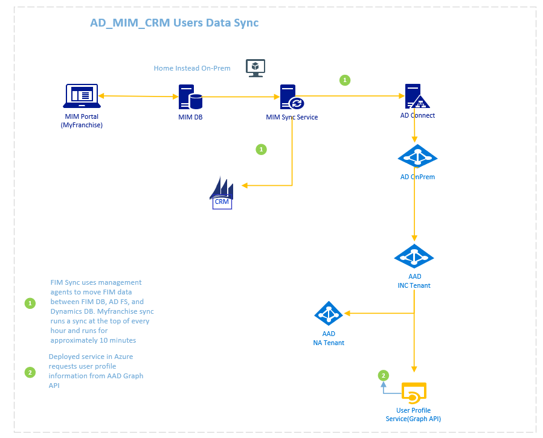
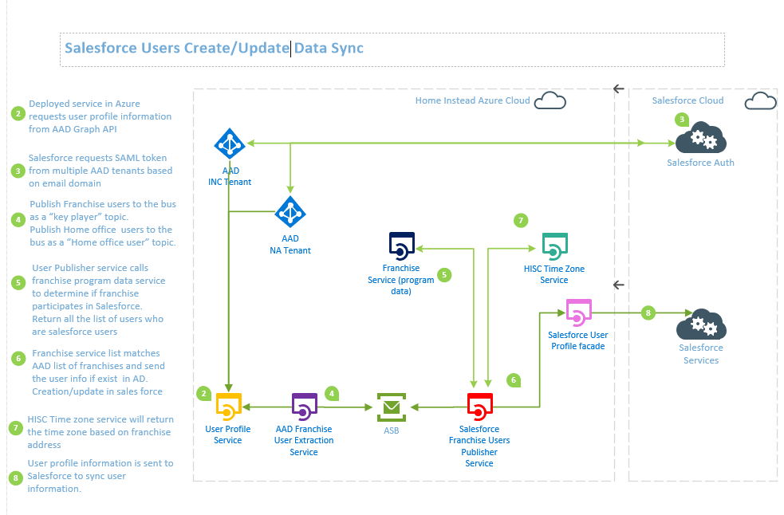
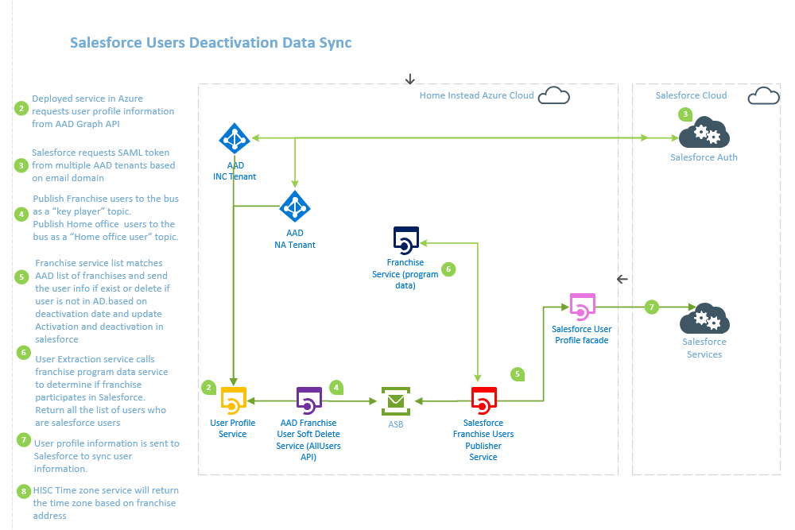

# AD_Users_Publisher
Extracting Users from Active Directory and publishing them to message bus

Consuming the messages from the message bus, processing them, and PUT'ing them to HISC Salesforce API Endpoint
## Ownership:
Owned by Home Instead Web Marketing department. Lead contact is Sadia Shoiab.

## Architecture

### Landscape diagrams (AD_MIM_CRM Users Data Sync)
Displays how system integrate with internal and external systems.

  

### Landscape diagrams (Salesforce Users Create/Update Data Sync)
Display how system integrate with internal and external systems.

     
### Landscape3 (Salesforce Users Deactivation Data Sync)

 

## Deployment
The deployment process for the users management will be deployed through Azure DevOps.  Deployment to the QA Server is done by the developers as needed without approval from CAB. Deployment to the Production Server requires CAB approval.  The deployment is done through Azure DevOps.

You can review the following documentation for [Azure Environment Setup](Documentation/Steps to Create Azure Resources.md).

## Development Process
Development will be performed on local machines by developers. Each commit to the repository will kick off unit tests to validate the integrity of the code.  Then the newly commited code will be automatically deployed to the QA Server for review.  If it passes tests and review, then a CAB request is submitted.  Once approved the Code can be deployed to the Production Server.

Developers can use the [instructions for Development Environment Setup](Documentation/Steps to Create Azure Resources.md) to get their local environment running.

## Test Process
Testing will be performed by automated Unit Tests that are in the Visual Studio Solution.  There are also integration tests that can be executed through Postman. Here is the [Testing Documentation](Documentation/Steps to Create Azure Resources.md) that will describe each type of test.
